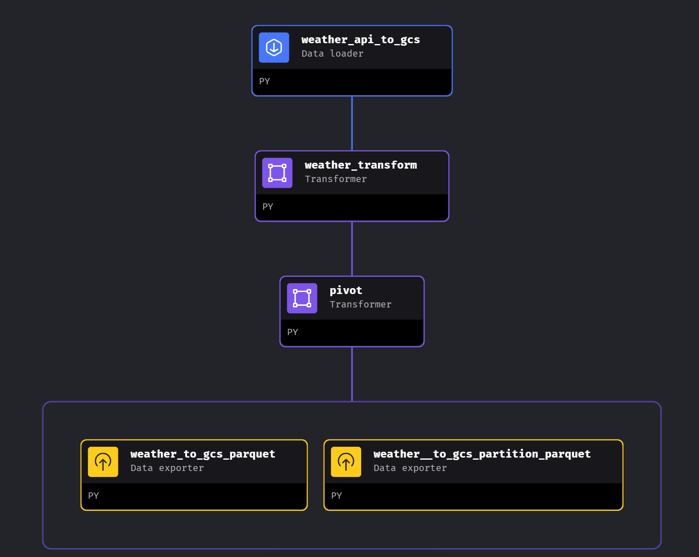

# Mage Workflow Orchestration

A GCS Bucket and BQ Dataset must be available in GCS to run this code. Make sure to change this in the mage pipelines python files with your infrastructure names. Additionally, a `.env` file must be created with the following parameters (the Weather API key can be obtained for free from the [Google Air Quality API](https://developers.google.com/maps/documentation/air-quality):

```bash
PROJECT_NAME=weather_project
GOOGLE_MAPS_API_KEY="your-free-api-key"
```

Once the environmental variables are set run `docker compose up` in the terminal (Docker Daemon must be open) and go to `http://localhost:6789`. There are three pipelines in mage:

- `api_to_gcs`: this will extract the data from the API, perform dataframe transformations and send the data to the GCS Bucket. There are two options to send the data. Directly to the GCS Bucket folder (run `weather_to_gcs_parquet`) or to a partitioned folder with the year/month/day structure (run `weather_to_gcs_partition_parquet`). The second one is the one used for this project

- `api_to_gcs_parameterized`: this one will perform the same workflow as above with the partitioned option

- `gcs_to_bq`: this will send the parquet file from the GCS Bucket to Big Query
  
&nbsp;


<p>
    
</p>

<p align="center">
    
</p>
